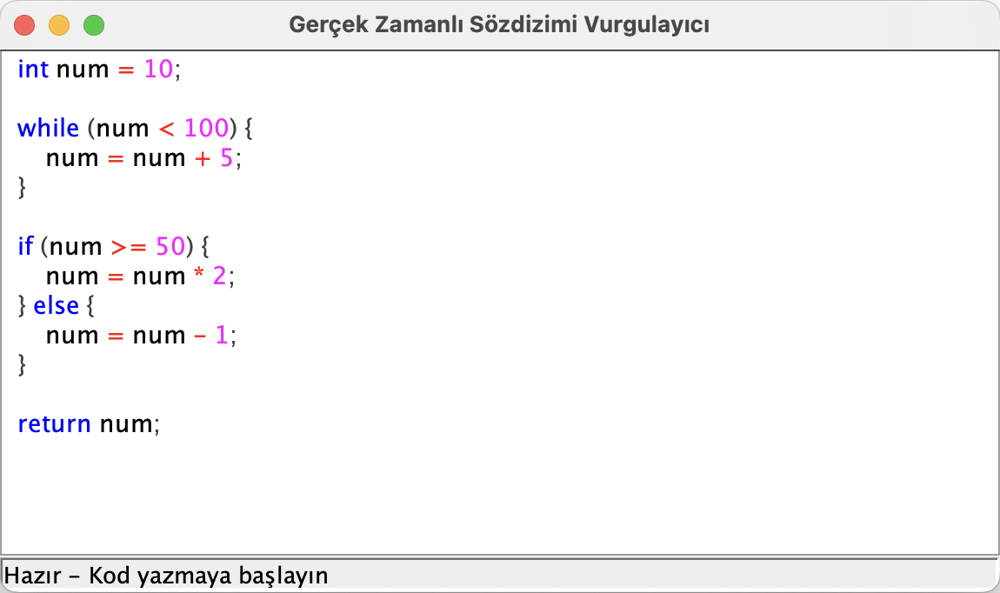

# Real-Time Syntax Highlighter

A real-time grammar-based syntax highlighter developed in Java using lexical analysis and recursive descent parsing techniques.

This project was built as part of a Compiler Design / Programming Languages study project and demonstrates the fundamentals of tokenization, parsing, syntax analysis and GUI-based code highlighting.

---

## Features

- Real-time syntax highlighting
- Grammar-based lexical analysis
- Recursive descent parser
- LL(1) parsing approach
- Java Swing graphical interface
- Token-based syntax coloring
- Real-time document updates
- Lightweight desktop application

---

## Technologies Used

- Java
- Java Swing
- Regex Pattern Matching
- Recursive Descent Parsing
- LL(1) Grammar
- StyledDocument API

---

## Project Architecture

```text
SyntaxHighlighterGUI
    ├── Lexer (Tokenization)
    ├── Parser (Grammar Validation)
    └── Real-time Highlighting
```

---

## Project Structure

```text
real-time-syntax-highlighter/
│
├── src/
│   ├── Lexer.java
│   ├── Parser.java
│   ├── Token.java
│   ├── TokenType.java
│   └── SyntaxHighlighterGUI.java
│
├── docs/
│   └── Documentation.md
│
├── examples/
│   └── sample-code.txt
│
├── screenshots/
│   └── gui-overview.png
│
├── .gitignore
└── README.md
```

---

## Supported Grammar

```text
Program → StatementList

StatementList → Statement StatementList | ε

Statement → Declaration
           | Assignment
           | If
           | While
           | Block

Declaration → int IDENTIFIER ;

Assignment → IDENTIFIER = Expression ;

If → if ( Expression ) Block [else Block]

While → while ( Expression ) Block

Block → { StatementList }

Expression → Term [Operator Term]*

Term → Factor

Factor → IDENTIFIER
       | NUMBER
       | ( Expression )
```

---

## Token Types

| Token Type | Description |
|---|---|
| KEYWORD | Language keywords |
| IDENTIFIER | Variable names |
| NUMBER | Numeric values |
| OPERATOR | Arithmetic and logical operators |
| SYMBOL | Parentheses, braces and punctuation |
| UNKNOWN | Unrecognized characters |

---

## Screenshot



---

## Example Input

```c
int num = 10;

while (num < 100) {
    num = num + 5;
}

if (num >= 50) {
    num = num * 2;
} else {
    num = num - 1;
}

return num;
```

---

## Installation

### Compile the project

```bash
javac src/*.java
```

### Run the application

```bash
java -cp src SyntaxHighlighterGUI
```

---

## Technical Details

### Lexer
- Regex-based tokenization
- Finite-state style lexical analysis
- Real-time token generation

### Parser
- Recursive descent parser
- LL(1) grammar implementation
- Basic error recovery with backtracking

### GUI
- Java Swing based desktop interface
- StyledDocument-based syntax coloring
- Timer-based update optimization

---

## Future Improvements

- Multi-language support
- Error highlighting
- File open/save support
- Line numbering
- Dark mode theme
- Abstract Syntax Tree (AST) visualization
- Code auto-completion

---

## Documentation

Detailed implementation documentation is available in:

```text
docs/Documentation.md
```

---

## Author

Magomed Umkhanov  
Computer Engineering Student
